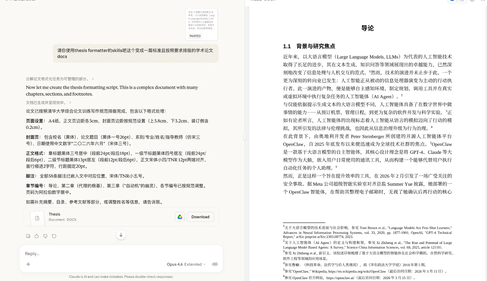

# Tsinghua Thesis Formatter (清华大学毕业论文排版)

[English](#english) | [中文](#中文)

---

<a name="english"></a>
## English

A Claude / Claude Code skill for formatting raw content (Markdown, plain text, or unformatted DOCX) into a **Tsinghua University (清华大学)** graduation thesis DOCX with pixel-perfect formatting.

> Based on the official Tsinghua University thesis formatting guidelines.



### What This Does

This skill handles all the tedious formatting requirements of a Tsinghua thesis so you can focus on writing content. It works in conjunction with the [`docx` skill](https://github.com/anthropics/skills/tree/main/skills/docx) to generate production-ready `.docx` files.

#### Key Features

- **Complete Document Structure** — Cover page, authorization statement, Chinese/English abstracts, table of contents, body chapters, references, acknowledgments — all in the correct order.
- **Exact Typography** — Every element uses the correct font, size, weight, and spacing as specified in the official guidelines (e.g., SimHei/Arial for headings, SimSun/Times New Roman for body text, down to the exact DXA units).
- **Precise Page Setup** — A4 paper with distinct margin profiles for the cover page (top 3.8 cm, gutter 0.2 cm) and all other pages (3.0 cm all around).
- **Automated Numbering** — Chapter numbering (`第 1 章`, `1.1`, `1.1.1`), Roman numeral page numbers before Chapter 1, Arabic numerals from Chapter 1 onward.
- **Three-line Tables** — Generates compliant three-line tables (三线表) with correct border weights.
- **Content Preservation Guarantee** — The skill is a formatter only. It will never rewrite, rephrase, add, or remove any of your text. Every sentence you wrote appears word-for-word in the output. Missing sections are left as explicit placeholders (e.g. `【请在此处填写摘要】`) rather than being fabricated.

### Dependencies

This skill requires the [`docx` skill](https://github.com/anthropics/skills/tree/main/skills/docx) to be installed alongside it. The `docx` skill provides the underlying DOCX generation and validation toolchain.

### Installation

> **Note:** `~/.claude/skills/` is the default skills directory for Claude Code on macOS/Linux. Adjust the path if your setup differs.

```bash
# 1. Install this skill
git clone https://github.com/humblebanana/thu-thesis-formatter.git ~/.claude/skills/thesis-formatter

# 2. Install the docx skill (required dependency)
#    Uses sparse-checkout to download only the docx skill, not the entire repo
git clone --filter=blob:none --sparse https://github.com/anthropics/skills.git /tmp/anthropic-skills
cd /tmp/anthropic-skills && git sparse-checkout set skills/docx
cp -r /tmp/anthropic-skills/skills/docx ~/.claude/skills/docx

# 3. Install the Node.js runtime dependency (used to generate .docx files)
npm install -g docx
```

### Usage

Trigger the skill by asking your AI agent:

```
/thesis-formatter Please format my draft into a Tsinghua thesis DOCX
```

---

<a name="中文"></a>
## 中文

这是一个专为 Claude / Claude Code 设计的 Skill，用于将未经排版的纯文本、Markdown 或 Word 文档，一键转换为完全符合**清华大学毕业论文**排版规范的 DOCX 文件。

> 基于清华大学官方综合论文训练写作规范。

### 功能介绍

这个 Skill 可以帮你处理所有繁琐的排版工作，让你能够专注于论文内容的撰写。它与 [`docx` skill](https://github.com/anthropics/skills/tree/main/skills/docx) 协同工作，生成可直接打印或提交的 Word 文档。

#### 核心特性

- **完整的文档结构** — 自动生成封面、授权说明、中英文摘要、目录、正文、参考文献、致谢等，顺序完全符合规范。
- **精准的字体排版** — 严格按照规范设置每一处元素的字体、字号、字重和行距（例如：标题使用黑体/Arial，正文使用宋体/Times New Roman，精确到 DXA 单位）。
- **标准的页面设置** — A4 纸张，针对封面（上边距 3.8 cm，装订线 0.2 cm）和正文（四周 3.0 cm）采用不同的页边距配置。
- **自动编号系统** — 自动处理章节编号（`第 1 章`、`1.1`、`1.1.1`），正文前使用罗马数字页码，正文起使用阿拉伯数字页码。
- **规范的三线表** — 自动生成符合学术规范的三线表，并应用正确的边框粗细。
- **内容神圣原则（防篡改）** — 该 Skill 仅作为排版工具。它**绝对不会**重写、润色、添加或删除你的任何文字。你写的每一句话都会一字不差地保留。对于缺失的章节，它只会留下明确的占位符（如 `【请在此处填写摘要】`），而不会自行捏造内容。

### 依赖说明

本 Skill 需要与 [`docx` skill](https://github.com/anthropics/skills/tree/main/skills/docx) 配合使用，`docx` skill 提供底层的 DOCX 生成与验证工具链。

### 安装方法

> **注意：** `~/.claude/skills/` 是 Claude Code 在 macOS/Linux 下的默认 skills 目录，请根据你的实际配置调整路径。

```bash
# 1. 安装本 Skill
git clone https://github.com/humblebanana/thu-thesis-formatter.git ~/.claude/skills/thesis-formatter

# 2. 安装 docx skill（必需依赖）
#    使用 sparse-checkout，只下载 docx skill，不拉取整个仓库
git clone --filter=blob:none --sparse https://github.com/anthropics/skills.git /tmp/anthropic-skills
cd /tmp/anthropic-skills && git sparse-checkout set skills/docx
cp -r /tmp/anthropic-skills/skills/docx ~/.claude/skills/docx

# 3. 安装 Node.js 运行时依赖（用于生成 .docx 文件）
npm install -g docx
```

### 使用方法

在你的 AI Agent 中触发该 Skill：

```
/thesis-formatter 帮我把这个文档按照清华大学毕业论文格式排版
```

---

## License

MIT — Use it, modify it, share it.
